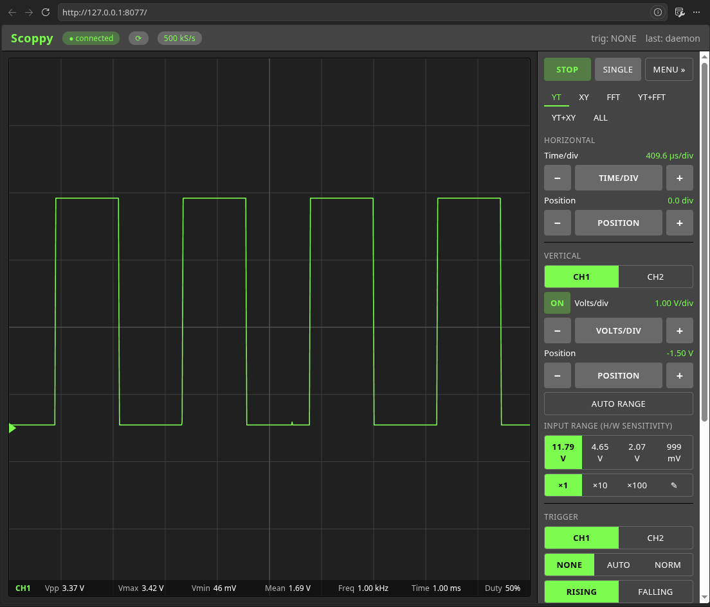

# pyscoppy — a shared oscilloscope for a Scoppy / FScope Pico

[](https://github.com/MrNoname3/pyscoppy/actions/workflows/ci.yml)

Drive a USB-connected Scoppy Pico (here: an **FHDM FScope-500K** board) directly,
without the Android app — and **share one live connection between a human and an
AI agent**. The protocol was reverse-engineered from the open-source firmware
plus live analysis, and validated on real **v18** hardware.

> ⚠️ **Very early days — alpha.** This is a young hobby project under active
> development. It works on my setup (FScope-500K + Pico, firmware v18), but it has
> had little testing on other hardware, firmware versions, or operating systems, so
> expect bugs and rough edges — don't rely on it for anything critical yet.
> **Testing reports, bug reports and PRs are very welcome** — especially from
> different boards/firmware.



## Architecture

Only one host can own the serial port, so a **daemon** holds a single persistent,
synced connection and shares the live stream + control over a local Unix socket.
The web GUI, the CLI, and the agent all connect to it at once; any client's
setting change is applied to the Pico and broadcast to everyone (tagged with who
changed it), so the human and the agent stay in sync.

```
   Pico/FScope ──USB──► scoppyd (daemon) ──unix socket──► { Web GUI, CLI, agent }
```

**Pairing with an AI agent?** [AGENTS.md](AGENTS.md) explains how an agent joins
the same live session — what it can observe (`state` / `stream` / `grab`) and how
its setting changes show up in the human's GUI.

## Use it

One-click: run [`run.py`](run.py) — in VSCode just press the **Run ▷** button (or
pick a config from the Run panel, see [.vscode/launch.json](.vscode/launch.json)).
It starts the daemon **and** serves the GUI in one process; stopping it (Ctrl-C or
the stop button) shuts both down. For a ready-to-go editor setup, open
[`pyscoppy.code-workspace`](pyscoppy.code-workspace) (*File > Open Workspace from
File…*) — it's fully portable (relative paths), so it works straight after a
clone and offers the Python/Pylance extensions it needs.

```bash
python3 run.py                       # daemon + GUI  → http://127.0.0.1:8077
python3 run.py --no-gui              # only the daemon
python3 run.py --gui-only            # only the GUI (a daemon must already run)
```

Or run the two halves separately (e.g. on different machines / terminals):

```bash
./run-daemon.sh                      # terminal 1: the shared daemon (owns the port)
./run-gui.sh                         # terminal 2: serve the GUI → http://127.0.0.1:8077

# the CLI / agent share the same daemon:
python3 -m pyscoppy state             # current shared settings
python3 -m pyscoppy stream            # live per-channel stats
python3 -m pyscoppy grab --plot       # sniff a chunk of the shared signal
python3 -m pyscoppy set --run stop    # change a setting -> everyone sees it
python3 -m pyscoppy set --channels 0,1 --trigger auto
```

**Requirements:** Python 3.8+ on Linux (it uses `/dev/ttyACM*` and Unix sockets).
Everything is **stdlib-only** — no venv, no pip, no third-party packages. `info`
(device identity) reads the serial directly, so run it only while the daemon is
stopped.

## What works

Two channels (CH1/CH2, color-coded), **real calibrated voltages** via the FScope
front-end ranges, VOLTS/DIV (switches the actual front-end gain), TIME/DIV,
horizontal/vertical position, client-side **trigger** (NONE/AUTO/NORM, level,
edge, pre-trigger, draggable markers, stabilized display) and **roll mode**.
Display modes: **YT, XY, FFT** (Hann/Hamming/Blackman, dBV/linear, span zoom) and
combined panes. **Cursors** (Δt, 1/Δt, ΔV), a **math** channel (CH1±CH2, invert),
a configurable set of **15 measurements**, **CSV export**, probe ×1/×10/×100 +
custom, and a **logic-analyzer** mode (8 channels). A menu offers Mode / Signal
Generator (freq/duty) / Channels / Max Sample Rate / Display / Help.

## Hardware

**FHDM FScope-500K** (2-channel analog front-end, ±6V/1X, 1MΩ, AC/DC, built-in
sig gen) on a regular Pico. It needs its own firmware
**`scoppy-fscope-500k-pico-v18.uf2`**, NOT the generic `scoppy-pico` build — the
generic build breaks calibration and CH2. The firmware is **not bundled** here;
download the matching `.uf2` from the Scoppy site (<https://oscilloscope.fhdm.xyz>)
and drop it in `firmware/`, then flash it (hold BOOTSEL, copy to the `RPI-RP2`
drive). The board/app call the channels CH1/CH2; internally they are firmware ids
0/1 (GP26/ADC0, GP27→front-end). See [HARDWARE.md](HARDWARE.md) and
[PROTOCOL.md](PROTOCOL.md). A plain Pico (no analog board) also works at 0–3.3 V.

## Layout

```
pyscoppy/
  protocol.py    wire protocol: framing, auth handshake, sample decode,
                 FScope calibration, sig gen, voltage ranges
  serial_port.py raw serial (CLOCAL/DTR)
  client.py      ScoppyClient: owns the serial, sync, sig gen, ranges
  daemon.py      scoppyd: the shared persistent connection (the hub)
  dclient.py     client library for the daemon (used by CLI + GUI)
  webgui.py      HTTP + SSE bridge to the daemon
  web/           the browser oscilloscope (index.html / app.css / app.js)
  cli.py         CLI: daemon, gui, state, stream, grab, set, info
tests/         hardware-free unit tests for the wire protocol (stdlib unittest)
PROTOCOL.md HARDWARE.md AGENTS.md   reference docs
run.py                              one-click launcher (daemon + GUI)
run-daemon.sh run-gui.sh            launchers for the two halves
run-checks.sh                       compile + tests + type check (CI runs this too)
firmware/      drop the device .uf2 here (not committed)
```

## Development

No build step — it's plain stdlib Python. Before sending a change, run the same
checks CI does:

```bash
./run-checks.sh          # byte-compile + unit tests + pyright (strict)
./run-checks.sh -v       # verbose test output
python3 -m unittest discover -s tests    # just the tests
```

The tests need no hardware (they exercise the pure protocol encode/decode), so
they run anywhere. `pyright` is optional locally — the script skips it with a
hint if it isn't installed (`pip install pyright`). CI
([.github/workflows/ci.yml](.github/workflows/ci.yml)) runs the tests on Python
3.8–3.12 plus a strict type-check, and works on both GitHub Actions and Gitea
Actions from that one file.

## Status & license

Early **alpha**, in active development. It's usable day to day on my own
FScope/Pico, but it still needs a lot of testing — on other boards, firmware
versions and setups — before it can be called stable, so expect rough edges and
breaking changes. Bug reports, testing feedback and PRs are very welcome.

Licensed under **GPL-3.0** — see [LICENSE](LICENSE). This is an independent
host-side implementation of the Scoppy USB protocol, written with reference to
the open-source Scoppy firmware (GPL-3.0, by FHDM Apps,
<https://oscilloscope.fhdm.xyz>). Scoppy and FScope are the work of their
respective authors; this project is not affiliated with or endorsed by them.
